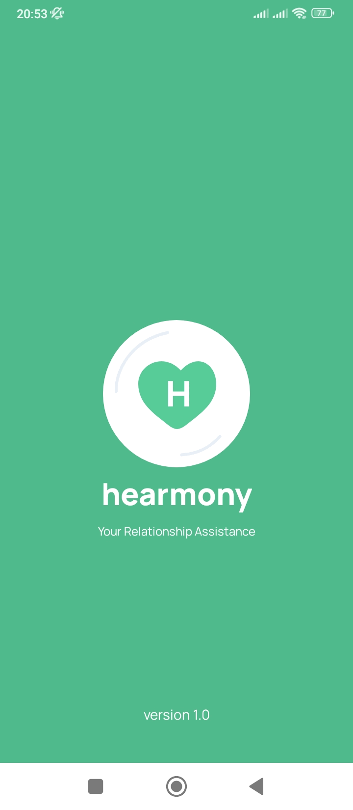

# Hearmony
**Hearmony** is a mobile application designed to support family harmony  
Developed by **tim otw mapan** [HF24-39]

## Team Details

#### Hustler
- Reynaldi Holtrop

#### Hipster
- Ega Rasendriya Nashrullah

#### Hacker
- Dzikry Aji Santoso
- Bonaventura Julio Putra Nandika

## Main Features
1. **Insight Chamber (prototype release)**
   - This feature presents news, articles, and educational tips that can add to family harmony, such as parenting materials, healthy relationships, achieving family goals, managing finances, and more.

2. **Relationship’s Goal Setter (prototype release)**
   - Helps married couples achieve their goals, especially in the financial context.
   - Users can see simulated savings results in various investment instruments.
   - Explore property price information supported by artificial intelligence features as a financial assistant.

3. **Consult Chat (under development)**
   - Allows users to consult with psychologists or therapists both online and offline regarding household problems.
   - The application provides the address, fee, and profile of psychologists or therapists for offline consultations.

## Getting Started

## Usage
To get started with this project, follow the steps below:

1. **Clone the Repository:**
   ```bash
   git clone https://github.com/your-username/your-repository.git
   ```

2. **Match local SDK:**
- Ensure that your local Android SDK version matches the project requirements.
- Update your local SDK version if necessary.

3. **Build the App:**
- Build and run the application on your Android device or emulator.


## License

**Hackfest 2024 Competition License**

This app is provided under the terms of the Hackfest 2024 Competition License.

### Permissions

- Anyone is allowed to modify and use this app for non-commercial purposes.

### Limitations

- Commercial use of this app is not permitted.

### Disclaimer

This app is distributed in the hope that it will be useful, but WITHOUT ANY WARRANTY; without even the implied warranty of MERCHANTABILITY or FITNESS FOR A PARTICULAR PURPOSE.

### Hackfest 2024 Competition

This app was developed specifically for submission to the Hackfest 2024 competition.

## Acknowledgments

This project relies on the contributions and technologies of various platforms and tools. We would like to express our gratitude to the following:

- **Google Firebase**: Serving as the primary storage solution, Firebase provides a reliable and scalable platform for storing and retrieving data.

- **Android**: The fundamental concepts of Android have played a crucial role in the development of this project, providing the basis for our mobile application.

- **Google Finance**: As the data provider, Google Finance has been instrumental in supplying the financial data necessary for the functionality of this project.

- **Google Apps Script**: The project utilizes Google Apps Script for API generation, enabling seamless communication and interaction between different components.

We extend our sincere thanks to the developers and communities behind these technologies, as they have significantly contributed to the success of this project.


## Contact
- Email: reynaldih@gmail.com
- Email: a.bnvt15@gmail.com

## Screenshots



